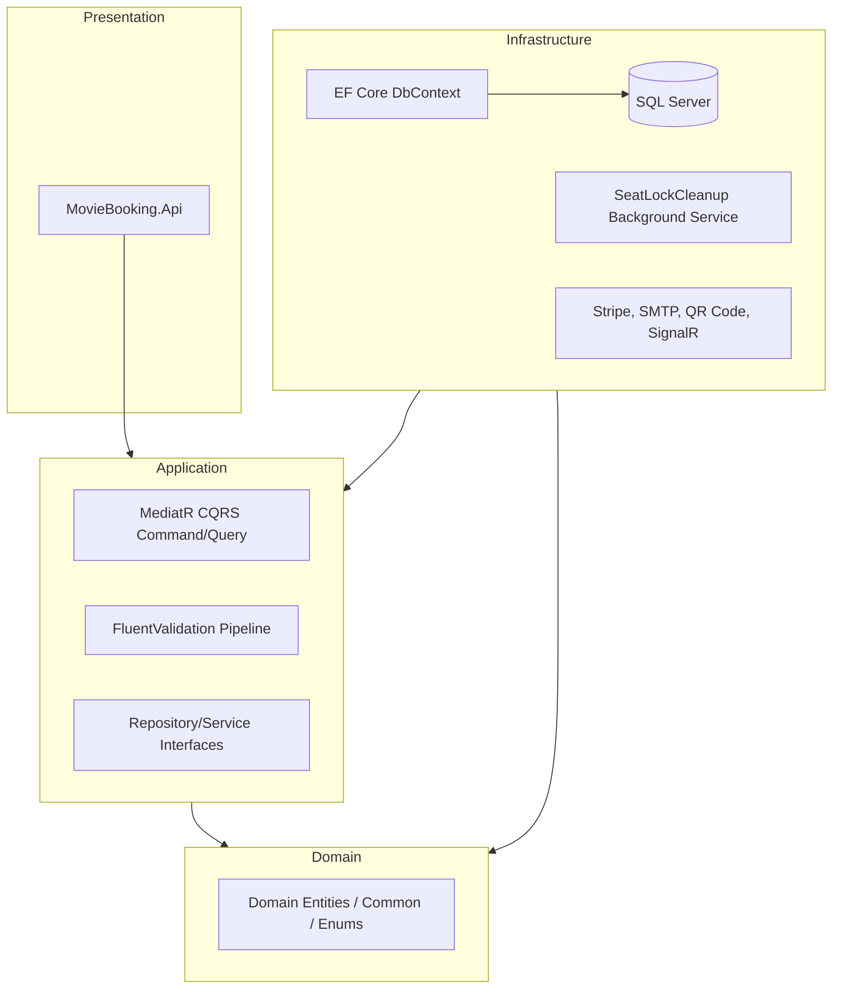

# 🎬 CinePass - Enterprise Movie Ticket Booking System

[](https://nextjs.org/)
[](https://dotnet.microsoft.com/)
[](https://www.microsoft.com/sql-server)
[](https://tailwindcss.com/)
[](https://stripe.com/)
[](https://learn.microsoft.com/en-us/aspnet/core/signalr/introduction)

CinePass is a highly scaleable, production-ready, full-stack **Movie Ticket Booking Application** engineered with modern design principles. Built using a **Clean Architecture** backend in **.NET 8.0** and a **Next.js (App Router)** frontend, the system delivers real-time updates, secure checkout flows, automated booking cleanups, and dynamic content management.

---

## 🖼️ Application Showcase (Screenshots)

> [!NOTE]
> Add your frontend screenshots in a folder named `screenshots` at the root of the project, then replace the image paths below.

<table width="100%">
  <tr>
    <td width="50%" align="center">
      <b>Landing Page (Now Showing / Slider)</b><br/>
      
    </td>
    <td width="50%" align="center">
      <b>Interactive Seat Selection</b><br/>
      
    </td>
  </tr>
  <tr>
    <td width="50%" align="center">
      <b>Stripe Secure Checkout</b><br/>
      
    </td>
    <td width="50%" align="center">
      <b>Admin Dashboard (Analytics & Showtimes)</b><br/>
      
    </td>
  </tr>
</table>

---

## 🚀 Key Architectural Features

### 🔹 Backend (.NET 8.0 Clean Architecture)
* **Domain-Driven Design (DDD)**: Organized into strict API, Application, Infrastructure, and Domain layers to isolate core business rules from frameworks and databases.
* **CQRS Pattern with MediatR**: Segregates read operations (Queries) from write operations (Commands) to increase query speed, scale teams easily, and keep controllers lightweight.
* **Real-time Synchronization (SignalR WebSockets)**: Pushes seat selection and lock statuses instantly to all active customers. If another user locks or books a seat, it updates in real-time without refreshing the page.
* **Distributed/Concurrent Locking (Background Services)**: Expired seat locks and pending unpaid bookings are automatically pruned by a hosted `SeatLockCleanupService` background worker running in the background.
* **Fluent Validation & Logging**: Validation pipelines intercept inputs before reaching handlers, throwing clean API exceptions. Structured logs are generated via **Serilog** for advanced debugging.
* **Secure Payment & Verification**: Integrates with **Stripe** Elements. On successful payment, the system creates unique, scannable digital tickets complete with **base64-encoded QR codes** and alerts users via SMTP email templates.

### 🔹 Frontend (Next.js 15/16 + Tailwind CSS v4)
* **React 19 & Next.js App Router**: Utilizes modern layouts, nested routing, and fast client-side navigation.
* **Server State Management (TanStack React Query)**: Provides intelligent client caching, background prefetching, and loading states for a highly fluid UX.
* **Global State (Zustand)**: Managing simple, lightweight local stores for auth states, city locations, and active seat sessions.
* **Robust Client Forms (React Hook Form + Zod)**: Implements type-safe form validations matching the backend schema rules.
* **Elegant UI Component Design**: Uses Radix UI primitives custom-styled with Tailwind CSS v4 to achieve premium animations, glassmorphic dropdowns, and responsive grids.

---

## 🛠️ Technology Stack

| Layer | Technologies | Key Libraries |
| :--- | :--- | :--- |
| **Frontend UI** | Next.js, React 19, Tailwind CSS v4 | Zustand, Axios, TanStack React Query, React Hook Form, Zod, Lucide Icons |
| **Backend API** | ASP.NET Core Web API (C#) | MediatR, FluentValidation, AutoMapper, Serilog, Swashbuckle (Swagger) |
| **Persistence** | Microsoft SQL Server | Entity Framework Core (Code-First Migrations, Fluent API Relations) |
| **Real-time** | ASP.NET Core SignalR | WebSocket connections for seat availability notifications |
| **Services** | Background Tasks, Payments, Mailing | Hosted Services, Stripe SDK, QRCoder, SMTP Client |
| **Infrastructure** | Containerization | Docker, Docker Compose |

---

## 🏗️ Architecture Design

The backend uses **Clean Architecture** to ensure testability, maintainability, and independence from outer-layer frameworks.



---

## 📂 Project Structure

```text
├── backend
│   └── MovieTicketBooking
│       ├── MovieBooking.Api             # REST Controllers, SignalR Hubs, Middlewares, Program.cs
│       ├── MovieBooking.Application     # CQRS Commands/Queries, Handlers, DTOs, Validation, Interfaces
│       ├── MovieBooking.Domain          # Domain Entities, Value Objects, Enums, Custom Exceptions
│       ├── MovieBooking.Infrastructure  # Data Context, Repositories, Background Services, Integrations
│       ├── MovieBooking.Application.Tests
│       └── MovieTicketBooking.sln       # VS Solution file
├── frontend
│   ├── app                              # Next.js App Router Page Layouts (admin, user, booking checkout)
│   ├── components                       # Reusable UI Primitives (DataTable, Modal, StarRating, etc.)
│   ├── lib                              # API Clients (Axios instances), Hooks, State Management (Zustand)
│   └── public                           # Static assets, fonts, icons
├── docker-compose.yml                   # Infrastructure Setup (SQL Server, Api, Frontend containers)
└── README.md                            # You are here
```

---

## ⚙️ Getting Started

Follow these instructions to run the project locally on your machine.

### Prerequisites
* **.NET 8.0 SDK** (Backend)
* **Node.js (v18+ or v20+)** (Frontend)
* **Docker Desktop** (For running SQL Server or the complete stack containerized)

---

### 💻 Local Run (Step-by-Step)

#### 1. Setup the Database
You can spin up the SQL Server database in Docker:
```bash
docker compose up sqlserver -d
```
*Alternatively, if you have a local SQL Express or LocalDB instance, you can update the connection string in `backend/MovieTicketBooking/MovieBooking.Api/appsettings.Development.json`.*

#### 2. Run the Backend API
Navigate to the API folder, restore dependencies, and start the application:
```bash
cd backend/MovieTicketBooking/MovieBooking.Api
dotnet run
```
* **Auto-Migrations & Seeding**: The API is configured to run Entity Framework Core migrations automatically on startup and seed data via `DataSeeder.cs`, populating realistic movies, theaters, showtimes, languages, and user roles.
* **Swagger API Documentation**: Available at `http://localhost:5000/index.html`.

#### 3. Run the Frontend App
Navigate to the frontend folder, install packages, and boot the Next.js dev server:
```bash
cd ../../../frontend
npm install
npm run dev
```
* **Client URL**: Open `http://localhost:3000` (or `http://localhost:3001` depending on port availability) in your browser.

---

### 🐳 Full Docker Stack Setup
To run the entire ecosystem (SQL Server, Backend API, Frontend Next.js app) inside containerized environments:
```bash
docker compose up --build -d
```
Access endpoints:
* **Frontend Application**: `http://localhost:3000`
* **Swagger API Endpoint**: `http://localhost:5000/index.html`

---

## 🔑 Seer / Test Credentials

The database seeder initializes the system with these users for rapid testing:

* **Administrator Account** (Full control over theater configurations, showtimes, movies):
  * **Email**: `admin@movietick.com`
  * **Password**: `Admin@123456`

* **Standard User Account** (Can browse movies, select seats, book, checkout via Stripe):
  * **Email**: `jeewa@gmail.com`
  * **Password**: `12345678`

---

## 🛡️ License

This project is licensed under the MIT License.
